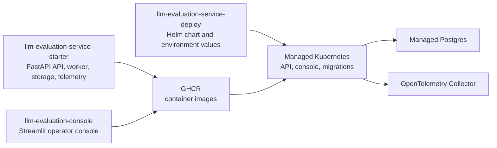

# Platform Map

The project is split into three repositories with separate responsibilities.

## Repositories

| Repository | Owns | Publishes |
| --- | --- | --- |
| `llm-evaluation-service-starter` | FastAPI service, domain logic, storage, OpenAPI, tests | `ghcr.io/bfalkowski/llm-evaluation-service-starter` |
| `llm-evaluation-console` | Streamlit console and console API client | `ghcr.io/bfalkowski/llm-evaluation-console` |
| `llm-evaluation-service-deploy` | Helm chart, values, deployment runbooks | Kubernetes manifests rendered by Helm |

## Runtime Shape

- API pods serve job submission, job listing, status, and tenant-scoped details.
- Console pods call the API through the in-cluster Service by default.
- Migration Jobs run Alembic before managed-environment rollouts.
- Managed Postgres stores job metadata and request payloads.
- The OTLP collector receives traces when `APP_OTEL_EXPORTER=otlp`.

## Local Shape

Local values enable:

- API Deployment.
- Console Deployment.
- Demo Postgres Deployment.
- Demo Secret values.
- Startup schema creation.

See `docs/local-platform.md`.

## Managed Shape

Managed values assume:

- Immutable image tags.
- Managed Postgres.
- Externally managed secrets.
- Migration Job enabled.
- Separate API and console ingress.
- OTLP collector endpoint.

See `docs/managed-kubernetes.md`.
